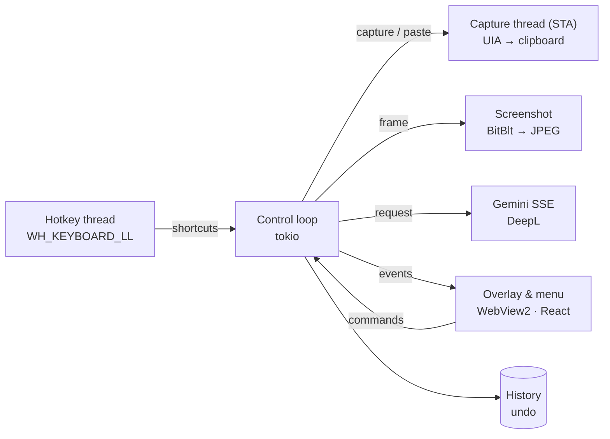

<div align="center">


# Restyle

**Rewrites the text you just typed — right inside the input field of any Windows app.**

Hotkey → style → the new text replaces the original. The model gets context from a snapshot of the active window.

**English** · [Українська](README.uk.md) · [Русский](README.ru.md)

[](https://github.com/Reva1v/Restyle/releases/latest)


</div>

---

## Features

| | |
|---|---|
| ✍️ **Rewrite styles** | Formal, Casual, Shorter, Longer, Fix grammar — plus your own styles with a custom instruction. The result streams into the panel; Enter puts it in place of the original. |
| 🌍 **Translation** | Translate-to-English / Russian / Ukrainian styles powered by DeepL (without a DeepL key the model translates). A translation can be polished with any style afterwards. |
| 🔠 **Case, no AI** | The “Aa Case” button in the panel: Sentence case, lowercase, UPPERCASE, Title Case, tOGGLE cASE. Respects the selection. |
| ⌨️ **Keyboard layout fix** | `Ctrl, Ctrl` turns “ghbdtn” into “привет” and back. The direction is detected automatically, the caret stays where it was, and the window switches to the right layout. |
| ⚡ **Quick styles** | A shortcut per style rewrites without the picker and can paste right away. A tap on the main hotkey can apply a style, holding it opens the panel. |
| ↩️ **Undo & history** | `Ctrl+Alt+Z` brings the original text back (press again for the result). The last 20 rewrites live in the tray menu and a history window, optionally on disk. |
| 🖼️ **Screenshot context** | A snapshot of the window or monitor goes to the model with the text, so it sees who and where you are writing to. Can be turned off globally, per style and per app. |
| 🎨 **Interface** | Light and dark themes, six accent colors, English / Ukrainian / Russian. |

## Usage

1. Type text into any field: a messenger, mail, browser, editor.
2. Press **`Ctrl+Alt+R`** — the style panel appears next to the cursor.
3. Pick a style with the mouse, a digit `1–9` or `Tab`, and wait for the result.
4. **`Enter`** — paste, **`R`** — regenerate, **`Esc`** — cancel.

| Shortcut | Action |
|---|---|
| `Ctrl+Alt+R` | Style panel (or a quick style on a short tap) |
| `Ctrl+Alt+Z` | Undo the last rewrite |
| `Ctrl, Ctrl` | Fix keyboard layout |
| per style | Quick style without the panel |

Every shortcut can be changed in settings: the field records the real key press, and double-tapping a modifier (`Ctrl, Ctrl`, `Shift, Shift`) counts as a shortcut too. Conflicts are highlighted.

The panel never steals focus: text is pasted where your caret stayed. If the window changed in the meantime, the paste is cancelled.

## Installation

Download the latest installer from **[Releases](https://github.com/Reva1v/Restyle/releases/latest)** — `Restyle_x.y.z_x64_en-US.msi` or `…_ru-RU.msi` — and run it.
To build it yourself, `pnpm tauri build` puts both MSI files into `src-tauri/target/release/bundle/msi/`.
On first launch a wizard asks for a [Gemini API key](https://aistudio.google.com/apikey),
shows the shortcuts and checks that the keyboard hook and field reading work.

> The MSI is not signed — SmartScreen will warn on first launch.

## Privacy & keys

- Gemini and DeepL keys are stored **only** in Windows Credential Manager (`keyring`) — never in JSON, logs or the frontend.
- The screenshot lives in memory for a single session and is never written to disk.
- Password managers and banking apps are excluded from screenshots by default; password fields are never read.
- In IDEs and editors only the selection is taken by default — the whole document never leaves your machine.
- The clipboard is restored right after reading and after pasting.
- Text (and the screenshot, if enabled) goes to Google Gemini; translation styles send text to DeepL. Nothing else leaves the machine.
- History is kept in memory; on disk (`history.json`, plain JSON) only if you turn it on.

## Building from source

Requirements: Windows 10 20H2+ / 11, [Rust](https://rustup.rs) (stable), Node.js 20+, [pnpm](https://pnpm.io), WebView2 (built into Windows 11), WiX Toolset for the MSI.

```bash
pnpm install
cd src-tauri && cargo test && cd ..   # unit tests + TS types generated into src/bindings/
pnpm tauri dev                        # dev mode (Vite :1430 + cargo)
pnpm tauri build                      # release + MSI
```

`src/bindings/` is generated from Rust (`ts-rs`) and is not committed — run `cargo test` before the first frontend build.

## Architecture

A single process; components talk over channels. `HWND`s, COM objects and the clipboard are touched only by the owning thread.



| Layer | Technologies |
|---|---|
| Shell | Tauri 2, `tauri-plugin-store`, `-autostart`, `-single-instance` |
| Backend | Rust, `windows` 0.58 (UIA, low-level hooks, BitBlt, DWM), `tokio`, `reqwest` (SSE), `keyring` |
| Frontend | React 18, TypeScript, Vite, Tailwind CSS 3, Motion, IBM Plex (bundled) |
| Types | `ts-rs`: Rust structs → `src/bindings/` |

Release build measurements: hotkey → rendered panel with captured text and screenshot **52–61 ms**, idle CPU **0.02 %**.

## Project layout

```
src-tauri/src/
  hotkey/       low-level keyboard hook, shortcut state machine (incl. double tap)
  capture/      UIA, clipboard, SendInput, processes, line endings
  ai/           Provider trait, Gemini SSE client
  control.rs    panel state machine: capture → generate → paste → undo
  textfx.rs     case and keyboard layout, no AI
  translate.rs  DeepL
  screenshot.rs BitBlt + JPEG
  settings.rs   settings, styles, normalization, shortcuts
  history.rs    history and undo
  window.rs     window placement, DWM, keyboard layouts
src/
  App.tsx       panel next to the cursor
  settings/     settings window (6 sections)
  history/      history window
  menu/         custom tray menu and case list
  welcome/      first-run wizard
  lib/          IPC, i18n, themes, shortcuts
scripts/        PowerShell E2E, Gemini mock, perf, icon generation
docs/           status and open tasks (in Russian)
```

## Development

```bash
cd src-tauri && cargo test            # 83 unit tests on pure logic
cargo clippy --all-targets
python scripts/mock_gemini.py 8765    # SSE mock: keys bad-key / rate / slow
pwsh -File scripts/e2e_paste.ps1      # paste & undo E2E in Notepad
pwsh -File scripts/e2e_settings.ps1   # quick styles, history, settings E2E
pwsh -File scripts/perf_release.ps1   # latency, CPU and memory of the release build
```

Debug variables for keyboard-free runs: `RESTYLE_DEMO=<ms>[:<style>]`, `RESTYLE_DEMO_SELECT`, `RESTYLE_DEMO_PASTE`, `RESTYLE_DEMO_UNDO`, `RESTYLE_DEMO_RELEASE`, `RESTYLE_DEMO_MENU`, `RESTYLE_DEMO_HIDE`; `RESTYLE_FORCE_CLIPBOARD=1`, `RESTYLE_DUMP_SCREENSHOT=<path>`, `RESTYLE_GEMINI_BASE_URL`, `RESTYLE_DEEPL_BASE_URL`, `RESTYLE_LOG_TRAY=1`.

The system prompt is `src-tauri/prompts/system.txt`; override it without rebuilding with `%APPDATA%\dev.reva1v.restyle\system_prompt.txt`.

## Documentation

- [`CLAUDE.md`](CLAUDE.md) — architecture, IPC contract and design decisions
- [`docs/STATUS.md`](docs/STATUS.md) — what is done, measurements, known limitations
- [`docs/TODO.md`](docs/TODO.md) — open tasks
