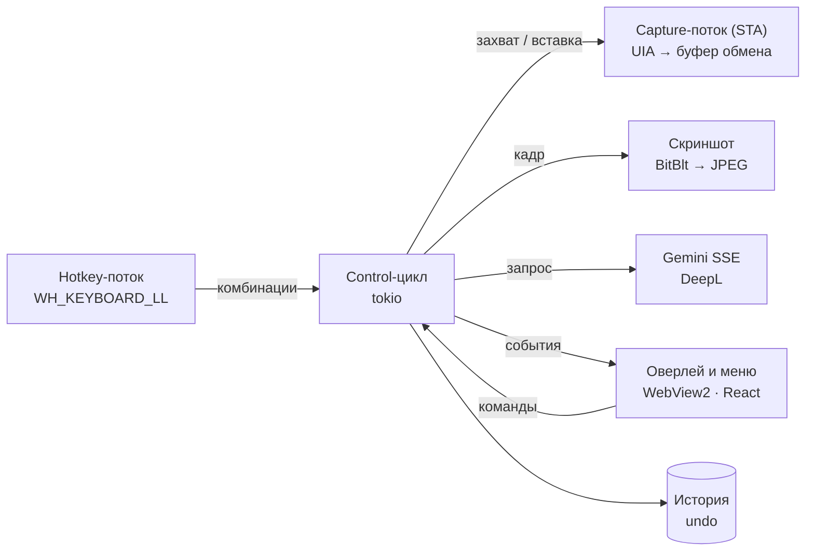

<div align="center">


# Restyle

**Переписывает набранный текст прямо в поле ввода — в любом приложении Windows.**

Хоткей → стиль → готовый текст на месте исходного. Контекст модель берёт со снимка активного окна.

[English](README.md) · [Українська](README.uk.md) · **Русский**

[](https://github.com/Reva1v/Restyle/releases/latest)


</div>

---

## Что умеет

| | |
|---|---|
| ✍️ **Стили переписывания** | Formal, Casual, Shorter, Longer, Fix grammar и свои стили с инструкцией для модели. Результат стримится в панель, Enter вставляет его вместо исходника. |
| 🌍 **Перевод** | Стили-переводы на английский, русский и украинский через DeepL (без ключа DeepL переводит модель). После перевода текст можно «причесать» любым стилем. |
| 🔠 **Регистр без модели** | Кнопка «Aa Регистр» в панели: как в предложении, все строчные, ВСЕ ПРОПИСНЫЕ, Каждое Слово С Заглавной, иНВЕРСИЯ. Учитывает выделение. |
| ⌨️ **Исправление раскладки** | `Ctrl, Ctrl` превращает «ghbdtn» в «привет» и обратно. Направление определяется само, каретка остаётся на месте, раскладка окна переключается на нужную. |
| ⚡ **Быстрые стили** | Своя комбинация на стиль — переписывает без панели выбора, по желанию сразу вставляет. Короткое нажатие основного хоткея может применять стиль, удержание — открывать панель. |
| ↩️ **Undo и история** | `Ctrl+Alt+Z` возвращает исходный текст (повторно — снова результат). Последние 20 переписываний — в меню трея и отдельном окне, по желанию на диске. |
| 🖼️ **Контекст со скриншота** | Снимок окна или монитора уходит в модель вместе с текстом — она видит, кому и где вы пишете. Отключается глобально, по стилю и по списку приложений. |
| 🎨 **Интерфейс** | Светлая и тёмная темы, шесть акцентных цветов, русский / украинский / английский. |

## Как пользоваться

1. Напишите текст в любом поле: мессенджер, почта, браузер, редактор.
2. Нажмите **`Ctrl+Alt+R`** — у курсора появится панель стилей.
3. Выберите стиль мышью, цифрой `1–9` или `Tab`, дождитесь результата.
4. **`Enter`** — вставить, **`R`** — сгенерировать заново, **`Esc`** — отмена.

| Комбинация | Действие |
|---|---|
| `Ctrl+Alt+R` | Панель стилей (или быстрый стиль по короткому нажатию) |
| `Ctrl+Alt+Z` | Вернуть предыдущий текст |
| `Ctrl, Ctrl` | Исправить раскладку |
| своя на стиль | Быстрый стиль без панели |

Все комбинации меняются в настройках: поле записывает реальное нажатие, двойное нажатие модификатора (`Ctrl, Ctrl`, `Shift, Shift`) — тоже комбинация. Конфликты подсвечиваются.

Панель никогда не забирает фокус: текст вставляется туда, где остался курсор. Если окно успело смениться, вставка отменяется.

## Установка

Скачайте свежий установщик из **[Releases](https://github.com/Reva1v/Restyle/releases/latest)** — `Restyle_x.y.z_x64_en-US.msi` или `…_ru-RU.msi` — и запустите его.
Чтобы собрать самому, `pnpm tauri build` кладёт оба MSI в `src-tauri/target/release/bundle/msi/`.
При первом запуске мастер попросит ключ [Gemini API](https://aistudio.google.com/apikey),
покажет хоткеи и проверит, что хук клавиатуры и чтение полей работают.

> MSI не подписан — при первом запуске SmartScreen покажет предупреждение.

## Приватность и ключи

- Ключи Gemini и DeepL хранятся **только** в Windows Credential Manager (`keyring`) — не в JSON, не в логах и не во фронтенде.
- Скриншот живёт в памяти одной сессии и не пишется на диск.
- Менеджеры паролей и банковские клиенты по умолчанию в списке «никогда не снимать экран»; поля паролей не читаются вовсе.
- В IDE и редакторах по умолчанию берётся только выделение — документ целиком никуда не уходит.
- Буфер обмена восстанавливается сразу после чтения и после вставки.
- Текст (и скриншот, если включён) уходит в Google Gemini; стили-переводы отправляют текст в DeepL. Больше ничего с компьютера не уходит.
- История живёт в памяти; на диске (`history.json`, обычный JSON) — только если включить.

## Сборка из исходников

Нужны: Windows 10 20H2+ / 11, [Rust](https://rustup.rs) (stable), Node.js 20+, [pnpm](https://pnpm.io), WebView2 (есть в Windows 11), WiX Toolset для MSI.

```bash
pnpm install
cd src-tauri && cargo test && cd ..   # юнит-тесты + генерация TS-типов в src/bindings/
pnpm tauri dev                        # дев-режим (Vite :1430 + cargo)
pnpm tauri build                      # релиз + MSI
```

`src/bindings/` генерируется из Rust (`ts-rs`) и не хранится в репозитории — перед первой сборкой фронтенда запустите `cargo test`.

## Архитектура

Один процесс, компоненты общаются каналами; `HWND`, COM-объекты и буфер обмена трогает только поток-владелец.



| Слой | Технологии |
|---|---|
| Оболочка | Tauri 2, `tauri-plugin-store`, `-autostart`, `-single-instance` |
| Бэкенд | Rust, `windows` 0.58 (UIA, LL-хуки, BitBlt, DWM), `tokio`, `reqwest` (SSE), `keyring` |
| Фронтенд | React 18, TypeScript, Vite, Tailwind CSS 3, Motion, IBM Plex (локально) |
| Типы | `ts-rs`: структуры Rust → `src/bindings/` |

Замеры на релизной сборке: хоткей → отрисованная панель с текстом и снятым кадром **52–61 мс**, CPU в простое **0,02 %**.

## Структура

```
src-tauri/src/
  hotkey/       LL-хук клавиатуры, автомат комбинаций (в т.ч. двойное нажатие)
  capture/      UIA, буфер обмена, SendInput, процессы, переводы строк
  ai/           трейт Provider, Gemini SSE-клиент
  control.rs    state-машина панели: захват → генерация → вставка → undo
  textfx.rs     регистр и раскладка без модели
  translate.rs  DeepL
  screenshot.rs BitBlt + JPEG
  settings.rs   настройки, стили, нормализация, хоткеи
  history.rs    история и undo
  window.rs     размещение окон, DWM, раскладки клавиатуры
src/
  App.tsx       панель у курсора
  settings/     окно настроек (6 разделов)
  history/      окно истории
  menu/         своё меню трея и список регистров
  welcome/      мастер первого запуска
  lib/          IPC, i18n, темы, хоткеи
scripts/        E2E на PowerShell, мок Gemini, замеры, генерация иконок
docs/           статус и незакрытые задачи
```

## Разработка

```bash
cd src-tauri && cargo test            # 79 юнит-тестов на чистую логику
cargo clippy --all-targets
python scripts/mock_gemini.py 8765    # мок SSE: ключи bad-key / rate / slow
pwsh -File scripts/e2e_paste.ps1      # E2E вставки и undo в Блокноте
pwsh -File scripts/e2e_settings.ps1   # E2E быстрых стилей, истории, настроек
pwsh -File scripts/perf_release.ps1   # задержка, CPU и память релиза
```

Переменные для отладки без клавиатуры: `RESTYLE_DEMO=<мс>[:<style>]`, `RESTYLE_DEMO_SELECT`, `RESTYLE_DEMO_PASTE`, `RESTYLE_DEMO_UNDO`, `RESTYLE_DEMO_RELEASE`, `RESTYLE_DEMO_MENU`, `RESTYLE_DEMO_HIDE`; `RESTYLE_FORCE_CLIPBOARD=1`, `RESTYLE_DUMP_SCREENSHOT=<путь>`, `RESTYLE_GEMINI_BASE_URL`, `RESTYLE_DEEPL_BASE_URL`, `RESTYLE_LOG_TRAY=1`.

Системный промпт — `src-tauri/prompts/system.txt`; без пересборки его можно переопределить файлом `%APPDATA%\dev.reva1v.restyle\system_prompt.txt`.

## Документация

- [`CLAUDE.md`](CLAUDE.md) — архитектура, контракт IPC и принятые решения
- [`docs/STATUS.md`](docs/STATUS.md) — что сделано, замеры, известные ограничения
- [`docs/TODO.md`](docs/TODO.md) — незакрытые задачи
