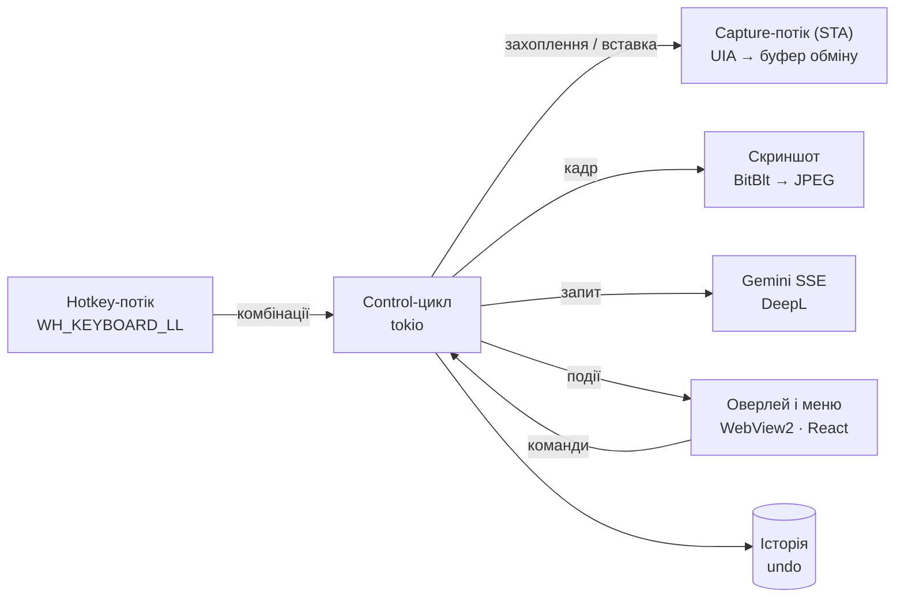

<div align="center">


# Restyle

**Переписує щойно набраний текст — просто в полі введення будь-якої програми Windows.**

Хоткей → стиль → готовий текст на місці вихідного. Контекст модель бере зі знімка активного вікна.

[English](README.md) · **Українська** · [Русский](README.ru.md)

[](https://github.com/Reva1v/Restyle/releases/latest)


</div>

---

## Можливості

| | |
|---|---|
| ✍️ **Стилі переписування** | Formal, Casual, Shorter, Longer, Fix grammar і власні стилі з інструкцією для моделі. Результат стрімиться в панель, Enter вставляє його замість вихідного. |
| 🌍 **Переклад** | Стилі-переклади англійською, російською та українською через DeepL (без ключа DeepL перекладає модель). Після перекладу текст можна «причесати» будь-яким стилем. |
| 🔠 **Регістр без моделі** | Кнопка «Aa Регістр» у панелі: як у реченні, усі малі, УСІ ВЕЛИКІ, Кожне Слово З Великої, іНВЕРСІЯ. Враховує виділення. |
| ⌨️ **Виправлення розкладки** | `Ctrl, Ctrl` перетворює «ghbdtn» на «привет» і назад. Напрямок визначається сам, каретка лишається на місці, розкладка вікна перемикається на потрібну. |
| ⚡ **Швидкі стилі** | Своя комбінація на стиль — переписує без панелі вибору й за бажанням одразу вставляє. Коротке натискання основного хоткея може застосовувати стиль, утримання — відкривати панель. |
| ↩️ **Undo та історія** | `Ctrl+Alt+Z` повертає вихідний текст (повторно — знову результат). Останні 20 переписувань — у меню трею та окремому вікні, за бажанням на диску. |
| 🖼️ **Контекст зі скриншота** | Знімок вікна або монітора йде в модель разом із текстом — вона бачить, кому і де ви пишете. Вимикається глобально, для стилю та за списком програм. |
| 🎨 **Інтерфейс** | Світла й темна теми, шість акцентних кольорів, англійська / українська / російська. |

## Як користуватися

1. Напишіть текст у будь-якому полі: месенджер, пошта, браузер, редактор.
2. Натисніть **`Ctrl+Alt+R`** — біля курсора з'явиться панель стилів.
3. Оберіть стиль мишею, цифрою `1–9` або `Tab`, дочекайтеся результату.
4. **`Enter`** — вставити, **`R`** — згенерувати знову, **`Esc`** — скасувати.

| Комбінація | Дія |
|---|---|
| `Ctrl+Alt+R` | Панель стилів (або швидкий стиль за коротким натисканням) |
| `Ctrl+Alt+Z` | Повернути попередній текст |
| `Ctrl, Ctrl` | Виправити розкладку |
| своя на стиль | Швидкий стиль без панелі |

Усі комбінації змінюються в налаштуваннях: поле записує реальне натискання, подвійне натискання модифікатора (`Ctrl, Ctrl`, `Shift, Shift`) — теж комбінація. Конфлікти підсвічуються.

Панель ніколи не забирає фокус: текст вставляється туди, де лишився курсор. Якщо вікно встигло змінитися, вставку скасовано.

## Встановлення

Завантажте свіжий інсталятор із **[Releases](https://github.com/Reva1v/Restyle/releases/latest)** — `Restyle_x.y.z_x64_en-US.msi` або `…_ru-RU.msi` — і запустіть його.
Щоб зібрати самостійно, `pnpm tauri build` кладе обидва MSI у `src-tauri/target/release/bundle/msi/`.
Під час першого запуску майстер попросить ключ [Gemini API](https://aistudio.google.com/apikey),
покаже хоткеї та перевірить, що хук клавіатури й читання полів працюють.

> MSI не підписаний — під час першого запуску SmartScreen покаже попередження.

## Приватність і ключі

- Ключі Gemini та DeepL зберігаються **лише** у Windows Credential Manager (`keyring`) — не в JSON, не в логах і не у фронтенді.
- Скриншот живе в пам'яті однієї сесії й не пишеться на диск.
- Менеджери паролів і банківські клієнти за замовчуванням у списку «ніколи не знімати екран»; поля паролів не читаються взагалі.
- В IDE та редакторах за замовчуванням береться лише виділення — документ цілком нікуди не йде.
- Буфер обміну відновлюється одразу після читання та після вставки.
- Текст (і скриншот, якщо ввімкнено) іде в Google Gemini; стилі-переклади надсилають текст у DeepL. Більше нічого з комп'ютера не йде.
- Історія живе в пам'яті; на диску (`history.json`, звичайний JSON) — лише якщо ввімкнути.

## Збирання з вихідного коду

Потрібні: Windows 10 20H2+ / 11, [Rust](https://rustup.rs) (stable), Node.js 20+, [pnpm](https://pnpm.io), WebView2 (є у Windows 11), WiX Toolset для MSI.

```bash
pnpm install
cd src-tauri && cargo test && cd ..   # юніт-тести + генерація TS-типів у src/bindings/
pnpm tauri dev                        # дев-режим (Vite :1430 + cargo)
pnpm tauri build                      # реліз + MSI
```

`src/bindings/` генерується з Rust (`ts-rs`) і не зберігається в репозиторії — перед першим збиранням фронтенду запустіть `cargo test`.

## Архітектура

Один процес, компоненти спілкуються каналами; `HWND`, COM-об'єкти й буфер обміну чіпає лише потік-власник.



| Шар | Технології |
|---|---|
| Оболонка | Tauri 2, `tauri-plugin-store`, `-autostart`, `-single-instance` |
| Бекенд | Rust, `windows` 0.58 (UIA, LL-хуки, BitBlt, DWM), `tokio`, `reqwest` (SSE), `keyring` |
| Фронтенд | React 18, TypeScript, Vite, Tailwind CSS 3, Motion, IBM Plex (локально) |
| Типи | `ts-rs`: структури Rust → `src/bindings/` |

Заміри на релізному збиранні: хоткей → відмальована панель із текстом і знятим кадром **52–61 мс**, CPU у простої **0,02 %**.

## Структура

```
src-tauri/src/
  hotkey/       LL-хук клавіатури, автомат комбінацій (зокрема подвійне натискання)
  capture/      UIA, буфер обміну, SendInput, процеси, переведення рядків
  ai/           трейт Provider, Gemini SSE-клієнт
  control.rs    state-машина панелі: захоплення → генерація → вставка → undo
  textfx.rs     регістр і розкладка без моделі
  translate.rs  DeepL
  screenshot.rs BitBlt + JPEG
  settings.rs   налаштування, стилі, нормалізація, хоткеї
  history.rs    історія та undo
  window.rs     розміщення вікон, DWM, розкладки клавіатури
src/
  App.tsx       панель біля курсора
  settings/     вікно налаштувань (6 розділів)
  history/      вікно історії
  menu/         власне меню трею і список регістрів
  welcome/      майстер першого запуску
  lib/          IPC, i18n, теми, хоткеї
scripts/        E2E на PowerShell, мок Gemini, заміри, генерація іконок
docs/           статус і незакриті задачі (російською)
```

## Розробка

```bash
cd src-tauri && cargo test            # 83 юніт-тести на чисту логіку
cargo clippy --all-targets
python scripts/mock_gemini.py 8765    # мок SSE: ключі bad-key / rate / slow
pwsh -File scripts/e2e_paste.ps1      # E2E вставки та undo в Блокноті
pwsh -File scripts/e2e_settings.ps1   # E2E швидких стилів, історії, налаштувань
pwsh -File scripts/perf_release.ps1   # затримка, CPU і пам'ять релізу
```

Змінні для налагодження без клавіатури: `RESTYLE_DEMO=<мс>[:<style>]`, `RESTYLE_DEMO_SELECT`, `RESTYLE_DEMO_PASTE`, `RESTYLE_DEMO_UNDO`, `RESTYLE_DEMO_RELEASE`, `RESTYLE_DEMO_MENU`, `RESTYLE_DEMO_HIDE`; `RESTYLE_FORCE_CLIPBOARD=1`, `RESTYLE_DUMP_SCREENSHOT=<шлях>`, `RESTYLE_GEMINI_BASE_URL`, `RESTYLE_DEEPL_BASE_URL`, `RESTYLE_LOG_TRAY=1`.

Системний промпт — `src-tauri/prompts/system.txt`; без перезбирання його можна перевизначити файлом `%APPDATA%\dev.reva1v.restyle\system_prompt.txt`.

## Документація

- [`CLAUDE.md`](CLAUDE.md) — архітектура, контракт IPC і ухвалені рішення
- [`docs/STATUS.md`](docs/STATUS.md) — що зроблено, заміри, відомі обмеження
- [`docs/TODO.md`](docs/TODO.md) — незакриті задачі
